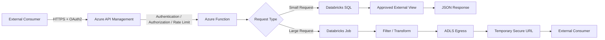
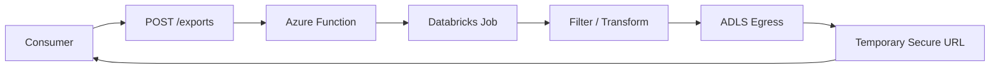

# On-Demand Data Sharing with Azure & Databricks

Securely share curated data with external consumers without exposing the internal data lake directly.

## Architecture



## 1. External View

Don't expose the internal Gold table directly.

```sql
CREATE OR REPLACE VIEW gold.external_data_view AS
SELECT
    id,
    transaction_date,
    amount,
    status
FROM gold.main_data
WHERE is_active = true;
```

The view controls which **rows and columns** are shared.

## 2. Small / On-Demand Request

```http
GET /api/v1/data/10001
Authorization: Bearer <token>
```

```text
API Management
      ↓
Azure Function
      ↓
Databricks SQL
      ↓
External View
      ↓
JSON Response
```

Parameterized query:

```python
query = """
SELECT id, transaction_date, amount, status
FROM gold.external_data_view
WHERE id = ?
"""

cursor.execute(query, (record_id,))
```

## 3. Large Data Request

For large datasets, use an asynchronous export instead of returning millions of records through the API.



Example response:

```json
{
  "request_id": "EXP-10001",
  "status": "PROCESSING"
}
```

## 4. Security

- **OAuth2 / Microsoft Entra ID** — Authentication
- **API Management** — Gateway and rate limiting
- **RBAC** — Authorization
- **Azure Key Vault** — Secrets
- **Managed Identity** — Service authentication
- **External Views** — Data control
- **Private Endpoints** — Network security
- **Audit Logs** — Access tracking

### Never store in GitHub

```text
Passwords
Tokens
SAS URLs
Private keys
Production credentials
```

## 5. Production Flow

**Small request**

```text
Consumer → APIM → Function → Databricks SQL → JSON
```

**Large request**

```text
Consumer → APIM → Function → Databricks Job → ADLS → Secure Download
```

## Key Principle

> **Never expose the internal Gold layer directly to external consumers.**

Use an **approved serving view** for API access and a **dedicated egress location** for large file-based exports.

## Repository Structure

```text
on-demand-data-sharing/
│
├── README.md
├── architecture/
│   └── on-demand-data-sharing.png
├── api/
│   └── function_app.py
├── sql/
│   └── external_views.sql
├── apim/
│   └── policy.xml
└── databricks/
    └── export_job.py
```
